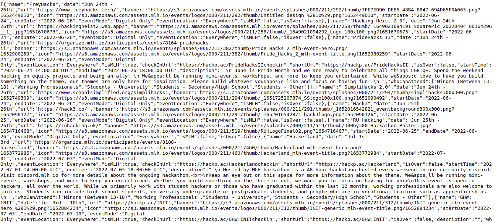

<h1 align=center>DEVENT-FETCH</h1>

> This is a simple code for devent events api(microservice)

<p align=center>

<a href="https://github.com/alestor123/DEVENT-FETCH/issues">
</a>

</p>

## 🚀 Usage

### With [vercel](https://now.sh)
```
$ git clone https://github.com/alestor123/DEVENT-FETCH.git
$ vercel deploy DEVENT-FETCH/ --env GHTOKEN=xxx
```

## Environment variables

Define the following environment variables:

- `GHTOKEN` - [Personal access token.](https://github.com/settings/tokens/new?description=gh-latest-repos)

# Screenshots    




# Data : 
> Fetch info from : 
 ## Hackathons
 [hackclub](https://hackclub.com/)
 [mlh](https://mlh.io/)
 ## Conferences
 
 [confs.tech](https://confs.tech/)


## 💖 [Donate](https://alestor123.is-a.dev/donate)


## Author

👤 **Alestor Aldous**

- Twitter: [@alestor123](https://twitter.com/alestor123)
- Github: [@alestor123](https://github.com/alestor123)


## 📝 License
> MIT

Copyright © 2022 [Alestor Aldous](https://github.com/alestor123).<br />
